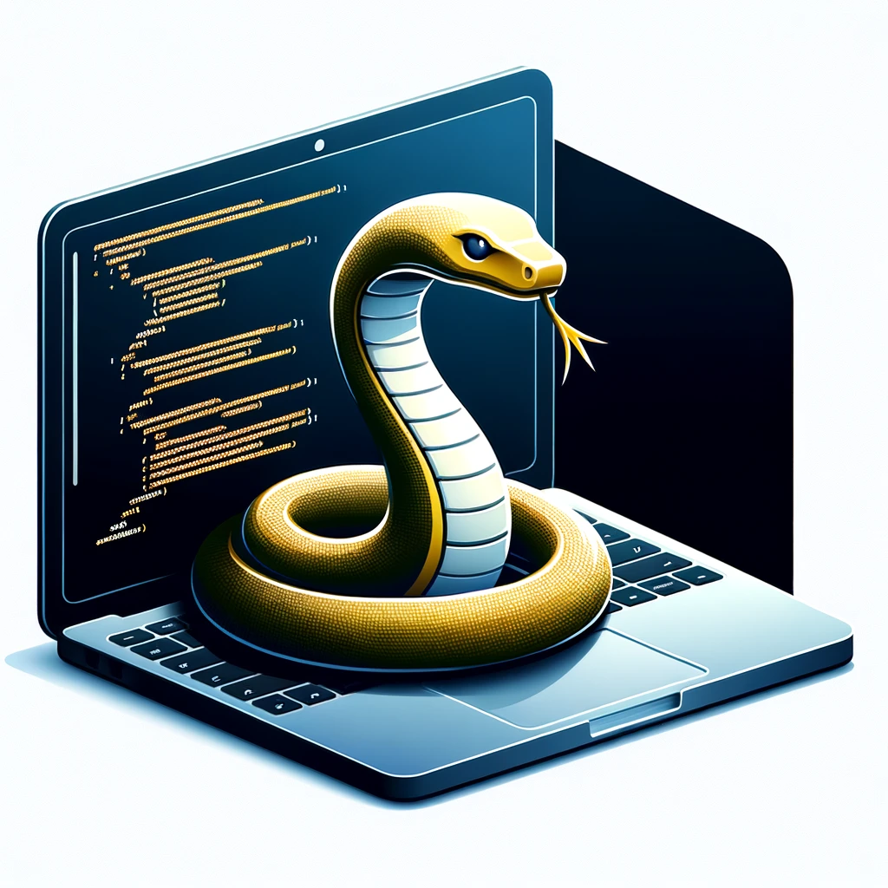

# Curso de Python para Principiantes

## Descripción
Bienvenido al repositorio del "Curso de Python para Principiantes". Este curso está diseñado para enseñarte los fundamentos de Python, uno de los lenguajes de programación más populares y versátiles en la actualidad. A lo largo de este curso, aprenderás desde los conceptos básicos hasta algunos temas avanzados, todo a tu propio ritmo y con una variedad de recursos prácticos.

## Contenido del Curso
El curso está dividido en varios módulos, cada uno cubriendo diferentes aspectos de Python:
1. **Introducción a Python** - ¿Qué es Python y por qué es popular?
2. **Fundamentos de Python** - Tipos de datos, operadores y estructuras de control.
3. **Estructuras de Datos** - Listas, tuplas, diccionarios y conjuntos.
4. **Funciones y Módulos** - Creación y uso de funciones; importación de módulos.
5. **POO en Python** - Introducción a la Programación Orientada a Objetos.
6. **Manejo de Archivos y Excepciones** - Lectura y escritura de archivos; manejo de errores.
7. **Librerías Populares** - Uso de bibliotecas como NumPy, Pandas y Matplotlib.
8. **Proyecto Final** - Aplicar lo aprendido en un proyecto completo.